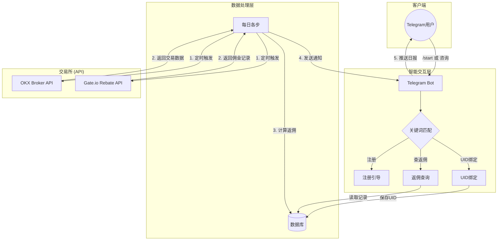
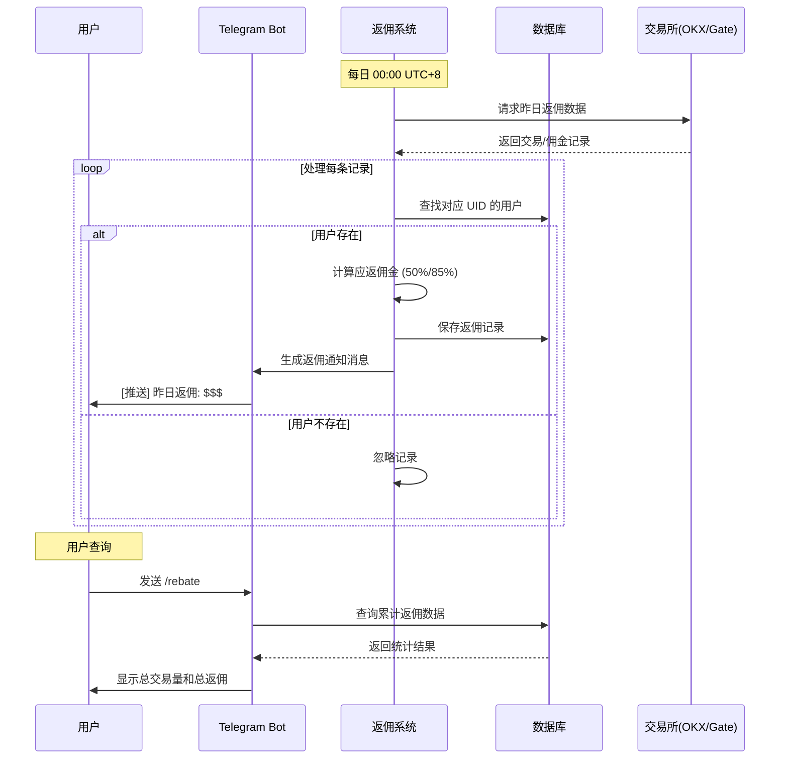
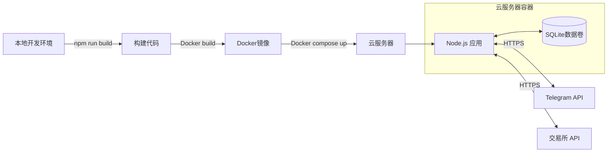

# Moltbot 返佣管家 - 实现流程图

## 1. 核心业务流程

```mermaid
graph TB
    subgraph "客户端"
        User((Telegram用户))
    end
    
    subgraph "智能交互层"
        Bot[Telegram Bot]
        Matcher{关键词匹配}
        Register[注册引导]
        Binding[UID绑定]
        Query[返佣查询]
    end
    
    subgraph "数据处理层"
        DB[(数据库)]
        Sync[每日各步]
    end
    
    subgraph "交易所 (API)"
        OKX[OKX Broker API]
        Gate[Gate.io Rebate API]
    end
    
    %% 用户交互流程
    User -- "/start 或 咨询" --> Bot
    Bot --> Matcher
    
    Matcher -- "注册" --> Register
    Matcher -- "UID绑定" --> Binding
    Matcher -- "查返佣" --> Query
    
    Binding -- "保存UID" --> DB
    Query -- "读取记录" --> DB
    
    %% 返佣同步流程 (每日 00:00)
    Sync -- "1. 定时触发" --> OKX
    Sync -- "1. 定时触发" --> Gate
    
    OKX -- "2. 返回交易数据" --> Sync
    Gate -- "2. 返回佣金记录" --> Sync
    
    Sync -- "3. 计算返佣" --> DB
    Sync -- "4. 发送通知" --> Bot
    Bot -- "5. 推送日报" --> User
```

## 2. 数据流向图

```mermaid
sequenceDiagram
    participant User as 用户
    participant Bot as Telegram Bot
    participant System as 返佣系统
    participant DB as 数据库
    participant Ex as 交易所(OKX/Gate)

    Note over System: 每日 00:00 UTC+8
    
    System->>Ex: 请求昨日返佣数据
    Ex-->>System: 返回交易/佣金记录
    
    loop 处理每条记录
        System->>DB: 查找对应 UID 的用户
        alt 用户存在
            System->>System: 计算应返佣金 (50%/85%)
            System->>DB: 保存返佣记录
            System->>Bot: 生成返佣通知消息
            Bot->>User: [推送] 昨日返佣: $$$
        else 用户不存在
            System->>System: 忽略记录
        end
    end
    
    Note over User: 用户查询
    
    User->>Bot: 发送 /rebate
    Bot->>DB: 查询累计返佣数据
    DB-->>Bot: 返回统计结果
    Bot->>User: 显示总交易量和总返佣
```

## 3. 部署架构流程

```mermaid
flowchart LR
    Dev[本地开发环境] -->|npm run build| Build[构建代码]
    Build -->|Docker build| Image[Docker镜像]
    Image -->|Docker compose up| Server[云服务器]
    
    subgraph "云服务器容器"
        App[Node.js 应用]
        Data[(SQLite数据卷)]
    end
    
    Server --> App
    App <--> Data
    App <-->|HTTPS| TG[Telegram API]
    App <-->|HTTPS| EX[交易所 API]
```
